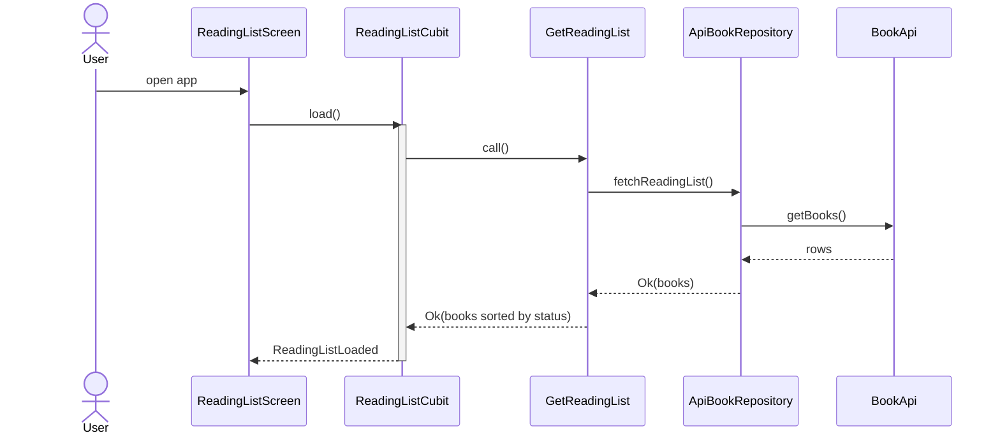
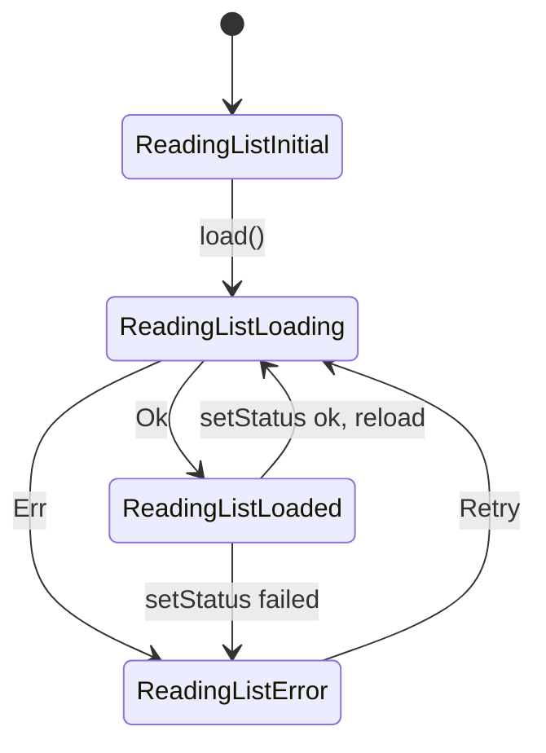
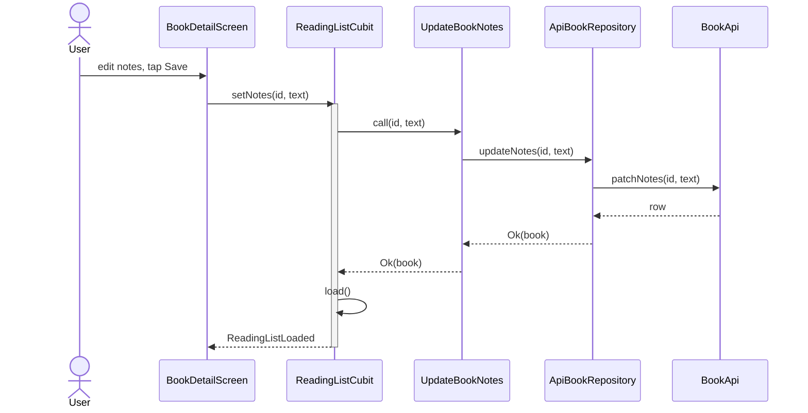

# VSDD Walkthrough: from a bare app to your first visual change

This guide takes `vsdd_testdrive` from a plain Flutter app to a project that uses
**OpenSpec** with **Visual Spec-Driven Development (VSDD)**. It then walks one real
change through the whole cycle: propose, review diagrams, implement, verify, and
archive.

- **Kit:** [github.com/joecrowley/vsdd-kit](https://github.com/joecrowley/vsdd-kit)
- **Time:** about 15 minutes to install and 20–30 minutes for the example change
- **You need:** an AI coding tool (Claude Code, OpenCode, Qwen Code, Codex, Cursor...),
  Node.js, Python ≥ 3.9 and FVM

> Your agent's output will differ in wording and detail from the examples below. The
> examples show the **shape** to expect, and what to look for when you review.

---

## Contents

1. [Prerequisites](#1-prerequisites)
2. [Get the kit](#2-get-the-kit)
3. [Install VSDD with your agent](#3-install-vsdd-with-your-agent)
4. [Check what was installed](#4-check-what-was-installed)
5. [Walkthrough: a change that needs diagrams](#5-walkthrough-a-change-that-needs-diagrams)
6. [Walkthrough: a change that doesn't](#6-walkthrough-a-change-that-doesnt)
7. [Maintenance drill: survive `openspec update`](#7-maintenance-drill-survive-openspec-update)
8. [Reset and repeat](#8-reset-and-repeat)
9. [Troubleshooting](#9-troubleshooting)

---

## 1. Prerequisites

```bash
npm install -g @fission-ai/openspec@latest      # OpenSpec CLI, needs >= 1.2.0
openspec --version
python3 --version                                # >= 3.9
npm install -g @mermaid-js/mermaid-cli           # optional: lets the validator render diagrams
fvm flutter test                                 # the app itself: 4 tests should pass
```

Start from the clean baseline: `git status` should show nothing to commit.

---

## 2. Get the kit

Clone it next to this project. SSH:

```bash
git clone git@github.com:joecrowley/vsdd-kit.git /Volumes/LacieStore/flutter/vsdd-kit
```

Or HTTPS:

```bash
git clone https://github.com/joecrowley/vsdd-kit.git /Volumes/LacieStore/flutter/vsdd-kit
```

If you already have it, update it with `git -C /Volumes/LacieStore/flutter/vsdd-kit pull`.

Optionally, check that the kit works with your OpenSpec version before installing:

```bash
/Volumes/LacieStore/flutter/vsdd-kit/tests/smoke_test.sh     # expect "All checks passed."
```

The kit's [`SETUP.md`](https://github.com/joecrowley/vsdd-kit/blob/main/SETUP.md) is the
runbook your agent follows. You don't need to read it, but it's worth skimming once.

---

## 3. Install VSDD with your agent

Open **this folder** in your AI coding tool and say:

> Follow `/Volumes/LacieStore/flutter/vsdd-kit/SETUP.md` to install VSDD into this project.

The agent works through the runbook's 10 steps (0 to 9). It stops only at **ASK**
points. Here is how to answer them for this test drive:

| The agent asks | Suggested answer |
|---|---|
| Which AI tools? | The tool you're using now, e.g. `claude`, or `opencode`. Add others if you want to test them too |
| (Only if the tree is dirty) Continue with uncommitted changes? | No. Commit or reset first |
| Seed capability-level diagrams too? | No. The architecture file is enough for this app |
| Add CI? | No. There's no `.github/` here. Say yes if you want to see the workflow file created |

What each step should do **in this project**:

| Step | Expected result here |
|---|---|
| 0 Preflight | Reports a **fresh install**: no `openspec/`, no tool folders, no earlier VSDD |
| 1 OpenSpec | Runs `openspec init --tools <your tools>`, creating `openspec/` and e.g. `.claude/skills`, `.claude/commands` |
| 2 Files | Adds `openspec/schemas/visual-driven/`, `docs/VSDD.md`, `docs/MERMAID_RULES.md` and `scripts/vsdd/` |
| 3 Config | Writes `openspec/config.yaml`. Its `context:` should describe **this** app: reading list, Cubit with sealed states, go_router, fake API. No `<PLACEHOLDER>` text |
| 4 Agent files | **Creates** `AGENTS.md`. Creates `CLAUDE.md` (containing `@AGENTS.md`) only if you chose Claude Code |
| 5 Overlay | Patches the skills and wraps the `/opsx` commands. `--check` prints `VSDD overlay OK.` |
| 6 Baseline | Creates `openspec/specs/architecture/diagrams.md` from the real code (see §4) |
| 7 CI | Skipped, unless you said yes |
| 8 Smoke test | Creates, validates, breaks, and deletes a `vsdd-smoke-test` change |
| 9 Report | A summary with sections for decisions made and anything needing your attention |

---

## 4. Check what was installed

Run these yourself. Don't just trust the agent's summary.

```bash
git status --short                                   # new files only, lib/ and test/ untouched
openspec schema validate visual-driven               # "Schema 'visual-driven' is valid"
python3 scripts/vsdd/install_overlay.py --check      # "VSDD overlay OK."
python3 scripts/vsdd/validate_mermaid.py --render    # "OK: ... 0 problems (rendered)"
ls openspec/changes                                  # empty or only archive/ (smoke test removed)
```

**Review the seeded diagrams.** Open `openspec/specs/architecture/diagrams.md` in a
Mermaid-capable preview (VS Code, or GitHub). Expect 2–4 `## <Stable Name>` sections
built from **real names in `lib/`**. Something like this:

````markdown
## End-to-End Data Flow

Loading the reading list, from screen to fake API and back.



## ReadingListState Machine

States emitted by ReadingListCubit.


````

Also expect a **Module Hierarchy** flowchart (`presentation → domain ← data`). There
should be **no System Topology** diagram, because this app has no backend or
infrastructure code. Search for a couple of the names (`grep -rn GetReadingList lib/`).
If anything in the diagrams doesn't exist in the code, the baseline is wrong. Fix it
before going on.

Commit the installation so the change in §5 shows up as a clean diff:

```bash
git add -A && git commit -m "chore: install VSDD"
```

---

## 5. Walkthrough: a change that needs diagrams

**The change:** *let readers keep private notes on a book, editable on the detail screen.*

This touches data flow (a new update path through all the layers) and the detail
screen, so it should get a **YES** gate.

Command names depend on the tool: `/opsx:propose` in Claude Code, `/opsx-propose` in
OpenCode and Qwen. This guide uses the Claude Code form.

### 5.1 Propose

> /opsx:propose add a private "notes" field to books, editable on the book detail screen

The agent creates `openspec/changes/add-book-notes/` and writes the artifacts in order:
`proposal.md → diagrams.md → specs/ → design.md → tasks.md`.

### 5.2 Review `proposal.md`

Check:
- **Why** is one or two sentences.
- **Capabilities** names a sensible new capability, such as `book-notes`.
- **Impact** lists the files that will change: `book.dart`, `book_api.dart`,
  `api_book_repository.dart`, a new use case, the Cubit and `book_detail_screen.dart`.

### 5.3 Review `diagrams.md`: the most important review point

Expect something like this:

````markdown
## Diagram needed?

YES - adds a notes update path through data, domain and presentation, and a new
detail-screen interaction.

## Before State

### End-to-End Data Flow
Loading the reading list, from screen to fake API and back.

<verbatim copy of the Source of Truth section, including its mermaid block>

## After State

### End-to-End Data Flow
Loading the reading list, from screen to fake API and back. Books now carry notes.

<same sequence diagram, with `R-->>G: Ok(books with notes)`>

### Notes Update Flow
Saving a note from the detail screen.


````

Review checklist:

| Check | Why it matters |
|---|---|
| The gate is YES, with a reason | A NO here would skip the visual review of a real flow change |
| The Before State is a **verbatim** copy of the Source of Truth section | It's the baseline reviewers compare against. Diff it against `openspec/specs/architecture/diagrams.md` |
| The After State keeps the **same stable name** (`End-to-End Data Flow`) | The archive replaces sections by name. A renamed section would leave the old one orphaned |
| The new diagram has a **new** stable name (`Notes Update Flow`) | It will be **appended** on archive |
| Participants use the naming style of the code | They'll be traced against the code later |
| It renders | Run `python3 scripts/vsdd/validate_mermaid.py --render` |

If something is off, say so now, e.g. *"notes should be saved on blur, not with a Save
button, so update the Notes Update Flow"*. Fixing a diagram costs far less than
fixing code.

### 5.4 Skim specs, design and tasks

- `specs/book-notes/spec.md`: `### Requirement:` blocks with `#### Scenario:`
  WHEN/THEN. For example, "notes persist after reload" and "an empty note clears the
  notes".
- `design.md`: decisions such as notes being optional (`String?`), and where the
  editing state lives.
- `tasks.md`: domain → data → presentation → tests. Because the gate is YES, the last
  task group should include **"trace the After State against the code and record
  Deviations, then run the validator"**. That comes from the `rules.tasks` entry in
  `config.yaml`.

### 5.5 Apply

> /opsx:apply

The agent works through `tasks.md`, ticking the checkboxes off. Before it declares
the change done, it **checks the After State against the code**: every participant
has to exist, in the layer the diagram shows.

**Invite a deviation**, to see how VSDD handles one. Part-way through, say:

> Instead of a separate `patchNotes`, give BookApi a single `patchBook(id, changes)` and
> use it for both status and notes.

Now the code no longer matches the proposed diagram. The agent should then:
1. update the After State so `Notes Update Flow` calls `patchBook(id, {notes})`,
2. add `### Status Update Flow` (or whichever section shows status updates), if the
   seeded diagrams include one, because that flow changed too,
3. add a `## Deviations` section like this:

```markdown
## Deviations
- **Proposed:** `BookApi.patchNotes(id, text)`. **Built:** `BookApi.patchBook(id, changes)`,
  shared with status updates. **Why:** one PATCH path for all book fields avoids
  duplicated latency and error handling (user decision during apply).
```

Then confirm the app still works:

```bash
fvm flutter analyze && fvm flutter test
```

### 5.6 Verify

> /opsx:verify

The report has a **Diagram Fidelity** check. Expect "no issues" if the agent handled
the deviation. To see the check work, rename `UpdateBookNotes` in the code *without*
updating the diagram, then run verify again. It should report a WARNING: *"Diagram
does not match code"*. Then undo the rename.

### 5.7 Archive

> /opsx:archive

The summary must include a **Diagrams** line, like this:

```
**Specs:** ✓ Synced to main specs
**Diagrams:** ✓ Merged into Source of Truth
  - replaced: End-to-End Data Flow
  - appended: Notes Update Flow
```

Check the result yourself:

```bash
grep -n "^## " openspec/specs/architecture/diagrams.md      # the new "Notes Update Flow" is present
git diff openspec/specs/architecture/diagrams.md            # only the named sections changed
ls openspec/changes/archive/                                # <date>-add-book-notes/
cat openspec/changes/archive/*-add-book-notes/diagrams.md   # Before, After and Deviations kept as history
python3 scripts/vsdd/validate_mermaid.py --render
```

What you should see:
- The **Source of Truth** now shows the code as it is, notes included.
- **Sections not named** in the After State (for example `ReadingListState Machine`)
  are unchanged.
- The **archive** keeps the Before/After pair and the Deviations note. That's the
  record of *why* the architecture changed.

```bash
git add -A && git commit -m "feat: book notes"
```

---

## 6. Walkthrough: a change that doesn't

Most bug fixes and cosmetic changes need no diagram. Try:

> /opsx:propose change the app theme seed colour from teal to indigo

Expected `diagrams.md`, in full:

```markdown
## Diagram needed?

NO - cosmetic theme change. No navigation, state, data flow, topology or schema impact.
```

Apply it, then archive. The archive summary should show `Diagrams: no-op`, and
`openspec/specs/architecture/diagrams.md` should be **unchanged** (`git diff` shows
nothing there).

---

## 7. Maintenance drill: survive `openspec update`

`openspec update` regenerates the stock skills and commands, and silently drops the
VSDD additions. Try it:

```bash
openspec update
python3 scripts/vsdd/install_overlay.py --check   # fails: "overlay missing" / "stock command"
python3 scripts/vsdd/install_overlay.py           # re-applies
python3 scripts/vsdd/install_overlay.py --check   # "VSDD overlay OK."
```

> `openspec update` also **removes** skills for workflows that aren't in your global
> profile (`openspec config list`). If you use extra workflows such as continue, ff or
> bulk-archive, add them with `openspec config profile` first.

---

## 8. Reset and repeat

To test the installation again, for example with a different AI tool or after changing
the kit:

```bash
git reset --hard baseline && git clean -fd
```

`baseline` is the tag on the bare-app commit. This removes `openspec/`, `AGENTS.md`,
`CLAUDE.md`, the tool folders, `scripts/vsdd/` and your example commits. Build caches
are kept, since they're gitignored.

To test local edits to the kit before pushing them, point your agent at your working
copy (`/Volumes/LacieStore/flutter/vsdd-kit/SETUP.md`) instead of a fresh clone.

---

## 9. Troubleshooting

| Symptom | Likely cause | Fix |
|---|---|---|
| The change has no `diagrams.md` | `config.yaml` doesn't say `schema: visual-driven` | Check `openspec/config.yaml`. `cat openspec/changes/<name>/.openspec.yaml` shows the schema used |
| `config.yaml` rules don't seem to apply | Wrong key (only `context:` and `rules:` are read) | `openspec instructions diagrams --change <name>` must show `<rules>` |
| The archive summary has no Diagrams line | Stock command or skill in use (overlay wiped) | `install_overlay.py --check`, then re-apply |
| "Diagrams: no-op" with a YES gate | After State used `##` instead of `### <Stable Name>` | Fix the headings. The validator flags this |
| A rendered diagram shows `"Name"` with quotes | Quoted participant alias | Use `participant A as Name`, without quotes |
| The seeded diagrams name classes that don't exist | The agent guessed instead of reading `lib/` | Ask it to redo Step 6, checking each name with grep |
| `/opsx:*` command not found | Tool not restarted after init, or a different command prefix | Restart the tool. Use `/opsx-*` in OpenCode and Qwen |

**Found a problem in the kit itself?** Note which step and what happened, fix it in
`vsdd-kit`, re-run `tests/smoke_test.sh` there, then reset this app (§8) and run the
installation again.
