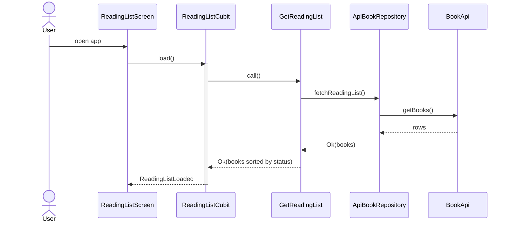
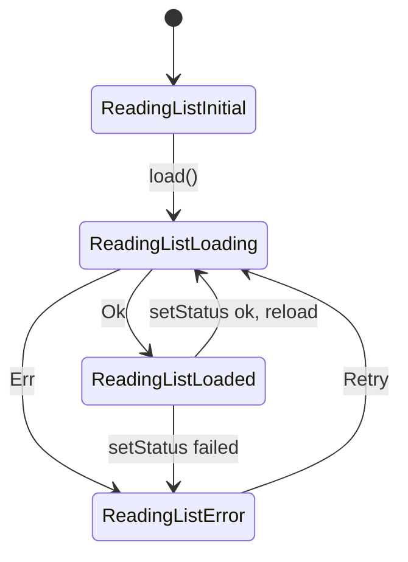
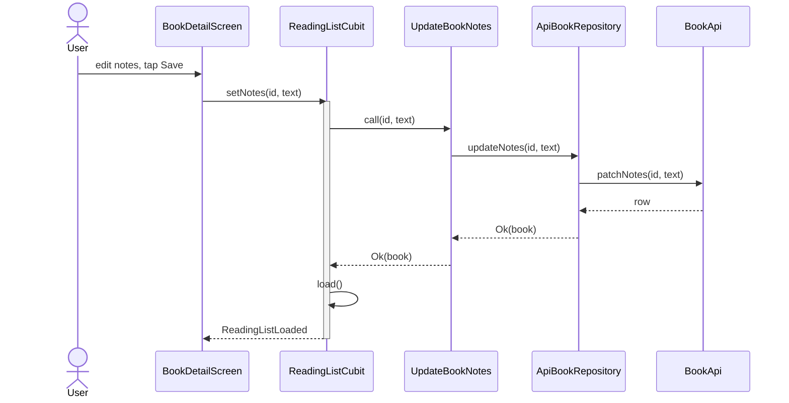

# VSDD Walkthrough: from a bare app to your first visual change

This guide takes `vsdd_testdrive` from a plain Flutter app to a project that uses
**OpenSpec** with **Visual Spec-Driven Development (VSDD)**. It then walks one real
change through the whole cycle: propose, review diagrams, implement, verify, and
archive.

- **Kit:** [github.com/joecrowley/vsdd-kit](https://github.com/joecrowley/vsdd-kit)
- **Time:** about 15 minutes to install and 20–30 minutes for the example change
- **You need:** an AI coding tool (Claude Code, OpenCode, Qwen Code, Codex, Cursor...),
  Node.js, Python ≥ 3.9 and FVM

> Your agent's output will differ in wording and detail from the examples below. The
> examples show the **shape** to expect, and what to look for when you review.

---

## Contents

1. [Prerequisites](#1-prerequisites)
2. [Get the kit](#2-get-the-kit)
3. [Install VSDD with your agent](#3-install-vsdd-with-your-agent)
4. [Check what was installed](#4-check-what-was-installed)
5. [Walkthrough: a change that needs diagrams](#5-walkthrough-a-change-that-needs-diagrams)
6. [Decisions drill: a lesson that sticks](#6-decisions-drill-a-lesson-that-sticks)
7. [Walkthrough: a change that doesn't](#7-walkthrough-a-change-that-doesnt)
8. [Maintenance drill: survive `openspec update`](#8-maintenance-drill-survive-openspec-update)
9. [Reset and repeat](#9-reset-and-repeat)
10. [Troubleshooting](#10-troubleshooting)

---

## 1. Prerequisites

```bash
npm install -g @fission-ai/openspec@latest      # OpenSpec CLI, needs >= 1.2.0
openspec --version
python3 --version                                # >= 3.9
npm install -g @mermaid-js/mermaid-cli           # optional: lets the validator render diagrams
fvm flutter test                                 # the app itself: 4 tests should pass
```

Start from the clean baseline: `git status` should show nothing to commit.

---

## 2. Get the kit

Clone it next to this project. SSH:

```bash
git clone git@github.com:joecrowley/vsdd-kit.git /Volumes/LacieStore/flutter/vsdd-kit
```

Or HTTPS:

```bash
git clone https://github.com/joecrowley/vsdd-kit.git /Volumes/LacieStore/flutter/vsdd-kit
```

If you already have it, update it with `git -C /Volumes/LacieStore/flutter/vsdd-kit pull`.

Optionally, check that the kit works with your OpenSpec version before installing:

```bash
/Volumes/LacieStore/flutter/vsdd-kit/tests/smoke_test.sh     # expect "All checks passed."
```

The kit's [`SETUP.md`](https://github.com/joecrowley/vsdd-kit/blob/main/SETUP.md) is the
runbook your agent follows. You don't need to read it, but it's worth skimming once.

---

## 3. Install VSDD with your agent

Open **this folder** in your AI coding tool and say:

> Follow `/Volumes/LacieStore/flutter/vsdd-kit/SETUP.md` to install VSDD into this project.

The runbook's **fast path** comes first. After you confirm the tools, the agent runs
the kit's installer, `vsdd_install.py`, which does Steps 0–5 in a few seconds and
prints a **"Left for you"** list. The agent then spends its time on the judgement
steps: describing this app in `config.yaml`, and drawing the baseline diagrams from
`lib/`. With a slow local model this saves many minutes.

You can also run the installer yourself first, and then ask the agent to do only the
"Left for you" items:

```bash
python3 /Volumes/LacieStore/flutter/vsdd-kit/files/scripts/vsdd/vsdd_install.py --root . --tools claude --dry-run
python3 /Volumes/LacieStore/flutter/vsdd-kit/files/scripts/vsdd/vsdd_install.py --root . --tools claude
```

The agent (or the installer) stops only at **ASK** points. Here is how to answer them
for this test drive:

| The agent asks | Suggested answer |
|---|---|
| Which AI tools? | The tool you're using now, e.g. `claude`, or `opencode`. Add others if you want to test them too |
| (Only if the tree is dirty) Continue with uncommitted changes? | No. Commit or reset first. The installer stops with exit 3 and suggests `--allow-dirty`; don't use it here |
| Seed capability-level diagrams too? | No. The architecture file is enough for this app |
| Turn existing conventions into decision entries? | No. This app documents none. §6 adds the first one, learned from a real bug |
| Add CI? | No. There's no `.github/` here. Say yes if you want to see the workflow file created |

What each step should do **in this project**:

| Step | Expected result here |
|---|---|
| 0–5 Installer | A **fresh install**, finished in seconds. It creates a `vsdd-install` branch and a snapshot under `~/.vsdd-snapshots/` (so it can be rolled back, §9), runs `openspec init --tools <your tools>`, adds `openspec/schemas/visual-driven/`, `docs/VSDD.md`, `docs/MERMAID_RULES.md` and `scripts/vsdd/`, writes `openspec/config.yaml` from the kit example, creates `AGENTS.md` (plus `CLAUDE.md` for Claude Code), applies the overlay (`VSDD overlay OK.`), and creates an empty `openspec/specs/architecture/decisions.md` |
| "Left for you" | Starts with: fill in `context:`, replace the TODO line in `AGENTS.md`, seed the baseline diagrams, the decision-entries question, CI, smoke test, report |
| 3 Context | The agent rewrites `context:` to describe **this** app: reading list, Cubit with sealed states, go_router, fake API. No `<PLACEHOLDER>` text |
| 4 Description | The TODO line at the top of `AGENTS.md` becomes a one-line description of the app |
| 6 Baseline | Creates `openspec/specs/architecture/diagrams.md` from the real code (see §4). `decisions.md` stays header-only |
| 7 CI | Skipped, unless you said yes |
| 8 Smoke test | Creates, validates, breaks, and deletes a `vsdd-smoke-test` change |
| 9 Report | A summary with sections for decisions made and anything needing your attention |

---

## 4. Check what was installed

Run these yourself. Don't just trust the agent's summary.

```bash
git status --short                                   # new files only, lib/ and test/ untouched
openspec schema validate visual-driven               # "Schema 'visual-driven' is valid"
python3 scripts/vsdd/install_overlay.py --check      # "VSDD overlay OK."
python3 scripts/vsdd/validate_mermaid.py --render    # "OK: ... 0 problems (rendered)"
ls openspec/changes                                  # empty or only archive/ (smoke test removed)
grep -c "<PROJECT_NAME>" openspec/config.yaml        # 0: context filled in
grep -c "TODO(vsdd)" AGENTS.md                       # 0: description filled in
grep -c "^## " openspec/specs/architecture/decisions.md   # 0: no rules yet (§6 adds one)
```

**Review the seeded diagrams.** Open `openspec/specs/architecture/diagrams.md` in a
Mermaid-capable preview (VS Code, or GitHub). Expect 2–4 `## <Stable Name>` sections
built from **real names in `lib/`**. Something like this:

````markdown
## End-to-End Data Flow

Loading the reading list, from screen to fake API and back.



## ReadingListState Machine

States emitted by ReadingListCubit.


````

Also expect a **Module Hierarchy** flowchart (`presentation → domain ← data`). There
should be **no System Topology** diagram, because this app has no backend or
infrastructure code. Search for a couple of the names (`grep -rn GetReadingList lib/`).
If anything in the diagrams doesn't exist in the code, the baseline is wrong. Fix it
before going on.

Commit the installation so the change in §5 shows up as a clean diff. You're on the
`vsdd-install` branch the agent created, so `main` stays bare:

```bash
git branch --show-current                            # vsdd-install
git add -A && git commit -m "chore: install VSDD"
```

---

## 5. Walkthrough: a change that needs diagrams

**The change:** *let readers keep private notes on a book, editable on the detail screen.*

This touches data flow (a new update path through all the layers) and the detail
screen, so it should get a **YES** gate.

Command names depend on the tool: `/opsx:propose` in Claude Code, `/opsx-propose` in
OpenCode and Qwen. This guide uses the Claude Code form.

### 5.1 Propose

> /opsx:propose add a private "notes" field to books, editable on the book detail screen

The agent creates `openspec/changes/add-book-notes/` and writes the artifacts in order:
`proposal.md → diagrams.md → specs/ → design.md → tasks.md`.

### 5.2 Review `proposal.md`

Check:
- **Why** is one or two sentences.
- **Capabilities** names a sensible new capability, such as `book-notes`.
- **Impact** lists the files that will change: `book.dart`, `book_api.dart`,
  `api_book_repository.dart`, a new use case, the Cubit and `book_detail_screen.dart`.

### 5.3 Review `diagrams.md`: the most important review point

Expect something like this:

````markdown
## Diagram needed?

YES - adds a notes update path through data, domain and presentation, and a new
detail-screen interaction.

## Placement

| Stable name | Source of Truth file | Action |
|---|---|---|
| End-to-End Data Flow | specs/architecture/diagrams.md | update |
| Notes Update Flow | specs/book-notes/diagrams.md | add |

## Before State

### End-to-End Data Flow
Loading the reading list, from screen to fake API and back.

<verbatim copy of the Source of Truth section, including its mermaid block>

## After State

### End-to-End Data Flow
Loading the reading list, from screen to fake API and back. Books now carry notes.

<same sequence diagram, with `R-->>G: Ok(books with notes)`>

### Notes Update Flow
Saving a note from the detail screen.


````

Review checklist:

| Check | Why it matters |
|---|---|
| The gate is YES, with a reason | A NO here would skip the visual review of a real flow change |
| There is a `## Placement` table with **one row per diagram** in Before/After | The archive merge applies these rows and nothing else. The validator fails if a row and a section don't match |
| **New flows go in their capability's file** (`Notes Update Flow` → `specs/book-notes/diagrams.md`, action `add`) | A diagram belongs to the capability whose behaviour it shows. Only cross-cutting diagrams, such as the end-to-end data flow, stay in `specs/architecture/diagrams.md`. Agents often get this wrong, so check it |
| Any row that **adds or moves** a diagram into `specs/architecture/diagrams.md` has a 4th column, `Why here`, naming the capabilities it spans | The validator rejects it otherwise. Because this change creates `book-notes`, it also prints a **warning** for any such row: usually the diagram belongs in `specs/book-notes/diagrams.md`. Updates to existing architecture diagrams, like `End-to-End Data Flow`, need no reason |
| The Before State is a **verbatim** copy of the Source of Truth section | It's the baseline reviewers compare against. The validator checks this, and the archive refuses to merge if the Source of Truth changed since |
| The After State keeps the **same stable name** (`End-to-End Data Flow`) | The archive replaces sections by name. A renamed section would leave the old one orphaned |
| The new diagram has a **new** stable name (`Notes Update Flow`) | It is added on archive, and the file is created if it doesn't exist yet |
| Participants use the naming style of the code | They'll be traced against the code later |
| It passes the validator | Run `python3 scripts/vsdd/validate_mermaid.py --render`. This also checks the Placement rows and the verbatim Before copy |

If something is off, say so now, e.g. *"notes should be saved on blur, not with a Save
button, so update the Notes Update Flow"*. Fixing a diagram costs far less than
fixing code.

### 5.4 Skim specs, design and tasks

- `specs/book-notes/spec.md`: `### Requirement:` blocks with `#### Scenario:`
  WHEN/THEN. For example, "notes persist after reload" and "an empty note clears the
  notes".
- `design.md`: decisions such as notes being optional (`String?`), and where the
  editing state lives. The agent reads `openspec/specs/architecture/decisions.md`
  before designing. It's empty for now, so there's nothing to follow yet.
  **Note how `setNotes` refreshes the list.** It will most likely copy `setStatus`:
  call `load()`, which emits `ReadingListLoading` first. That's the app's existing
  flicker bug, now in a second place. §6 turns it into a recorded lesson.
- `tasks.md`: domain → data → presentation → tests. Because the gate is YES, the last
  task group should include **"trace the After State against the code and record
  Deviations, then run the validator"**. That comes from the `rules.tasks` entry in
  `config.yaml`.

### 5.5 Apply

> /opsx:apply

The agent works through `tasks.md`, ticking the checkboxes off. Before it declares
the change done, it **checks the After State against the code**: every participant
has to exist, in the layer the diagram shows.

**Invite a deviation**, to see how VSDD handles one. Part-way through, say:

> Instead of a separate `patchNotes`, give BookApi a single `patchBook(id, changes)` and
> use it for both status and notes.

Now the code no longer matches the proposed diagram. The agent should then:
1. update the After State so `Notes Update Flow` calls `patchBook(id, {notes})`,
2. add `### Status Update Flow` (or whichever section shows status updates) to Before
   and After, with an `update` row in `## Placement`, if the seeded diagrams include
   one, because that flow changed too,
3. add a `## Deviations` section like this:

```markdown
## Deviations
- **Proposed:** `BookApi.patchNotes(id, text)`. **Built:** `BookApi.patchBook(id, changes)`,
  shared with status updates. **Why:** one PATCH path for all book fields avoids
  duplicated latency and error handling (user decision during apply).
```

Then confirm the app still works:

```bash
fvm flutter analyze && fvm flutter test
```

### 5.6 Verify

> /opsx:verify

The report has a **Diagram Fidelity** check. Expect "no issues" if the agent handled
the deviation. To see the check work, rename `UpdateBookNotes` in the code *without*
updating the diagram, then run verify again. It should report a WARNING: *"Diagram
does not match code"*. Then undo the rename.

### 5.7 Archive

> /opsx:archive

The agent runs `scripts/vsdd/merge_diagrams.py` on the change, with `--dry-run` first,
and the summary must include a **Diagrams** line, like this:

```
**Specs:** ✓ Synced to main specs
**Diagrams:** ✓ Merged into Source of Truth
  - replaced: End-to-End Data Flow in specs/architecture/diagrams.md
  - added (appended): Notes Update Flow to specs/book-notes/diagrams.md
**Decisions:** none
```

The **Decisions** line comes from the archive step that looks for lessons. Adding a
field teaches no general rule, so `none` is right here. §6 shows it proposing one.

You can preview the merge yourself before archiving:

```bash
python3 scripts/vsdd/merge_diagrams.py openspec/changes/add-book-notes --dry-run
```

Check the result yourself:

```bash
grep -n "^## " openspec/specs/book-notes/diagrams.md        # new file, with "Notes Update Flow"
git diff openspec/specs/architecture/diagrams.md            # only End-to-End Data Flow changed
ls openspec/changes/archive/                                # <date>-add-book-notes/
cat openspec/changes/archive/*-add-book-notes/diagrams.md   # Before, After and Deviations kept as history
python3 scripts/vsdd/validate_mermaid.py --render
```

What you should see:
- The **Source of Truth** now shows the code as it is, notes included.
- The **new capability owns its flow**: `specs/book-notes/` holds both `spec.md` and
  `diagrams.md`.
- **Sections without a Placement row** (for example `ReadingListState Machine`)
  are unchanged.
- The **archive** keeps the Before/After pair and the Deviations note. That's the
  record of *why* the architecture changed.

```bash
git add -A && git commit -m "feat: book notes"
```

---

## 6. Decisions drill: a lesson that sticks

Specs record what each capability does, not the lessons behind a fix. So a fix in one
place doesn't stop the same mistake in the next feature. That's what happened in §5:
`setNotes` copied the flicker from `setStatus`. The decisions log closes the gap.
This drill fixes the bug, records the lesson, and checks that the next feature follows
it.

### 6.1 See the bug

```bash
fvm flutter run -d macos
```

Open a book and change its status, or save a note. For a moment the detail screen
shows **"Book not found"**. The Cubit emits `ReadingListLoading` while it reloads, and
the detail screen can't find the book in a loading state.

### 6.2 Fix it

> /opsx:propose fix the "Book not found" flicker when changing status or saving notes on the detail screen

Review as in §5. Expect:
- **diagrams.md:** gate **YES**, because the state machine changes. `ReadingListState
  Machine` is an `update`, and the status and notes flows no longer go through
  `ReadingListLoading`.
- **design.md:** a silent refresh. The Cubit keeps emitting the current list and
  replaces it when the new data arrives. On failure it keeps the book on screen and
  shows a message, for example a SnackBar.
- **Tests** that fail on the old code. Ask for a delayed fake fetch if the agent's
  test would pass either way.

Then `/opsx:apply` and `/opsx:verify` as usual.

### 6.3 Archive: the lesson is proposed

> /opsx:archive

Before moving the change, the archive step asks whether the change teaches a rule.
Expect it to **show you a draft and ask** before writing anything, like this:

```markdown
## Silent Refresh After Writes
- **Rule:** after a write (status, notes, or any future field), refresh the list
  without emitting ReadingListLoading. Keep the current books until the new ones arrive.
- **Why:** a loading state drops the book, so the detail screen flashes "Book not found".
- **Applies to:** ReadingListCubit and any state holder that reloads after a mutation.
- **Source:** <date>-fix-book-detail-flicker
```

Say yes. The summary then includes `**Decisions:** added Silent Refresh After Writes`.

```bash
cat openspec/specs/architecture/decisions.md
python3 scripts/vsdd/validate_mermaid.py    # also checks each entry has Rule, Why and Source
git add -A && git commit -m "fix: detail screen flicker after writes"
```

Optionally, copy the rule into `context:` in `openspec/config.yaml` as a one-line
`Pitfalls:` entry, so that every artifact sees it even if an agent skips the file.

### 6.4 Prove it sticks

Propose another write on the detail screen:

> /opsx:propose let readers rate a book from 1 to 5 stars on the book detail screen

Check:
- `design.md` **follows the rule** (it mentions a silent refresh, or names *Silent
  Refresh After Writes*), or says `Overrides: Silent Refresh After Writes - <why>`.
- After apply, `ReadingListLoading` is still emitted only by `load()`:

  ```bash
  grep -n "ReadingListLoading" lib/presentation/reading_list/reading_list_cubit.dart
  ```

If the agent repeats the old pattern anyway, the decisions log didn't reach it. Check
that `openspec instructions design --change <name>` mentions `decisions.md`, and
that `install_overlay.py --check` passes.

---

## 7. Walkthrough: a change that doesn't

Most bug fixes and cosmetic changes need no diagram. Try:

> /opsx:propose change the app theme seed colour from teal to indigo

Expected `diagrams.md`, in full:

```markdown
## Diagram needed?

NO - cosmetic theme change. No navigation, state, data flow, topology or schema impact.
```

Apply it, then archive. The archive summary should show `Diagrams: no-op`, and
`openspec/specs/architecture/diagrams.md` should be **unchanged** (`git diff` shows
nothing there).

---

## 8. Maintenance drill: survive `openspec update`

`openspec update` regenerates the stock skills and commands, and silently drops the
VSDD additions. Try it:

```bash
openspec update
python3 scripts/vsdd/install_overlay.py --check   # fails: "overlay missing" / "stock command"
python3 scripts/vsdd/install_overlay.py           # re-applies
python3 scripts/vsdd/install_overlay.py --check   # "VSDD overlay OK."
```

> `openspec update` also **removes** skills for workflows that aren't in your global
> profile (`openspec config list`). If you use extra workflows such as continue, ff or
> bulk-archive, add them with `openspec config profile` first.

---

## 9. Reset and repeat

To test the installation again, for example with a different AI tool or after changing
the kit, roll the install back. The kit's
[`SETUP.md`](https://github.com/joecrowley/vsdd-kit/blob/main/SETUP.md#roll-back-an-install)
has the full procedure. Ask your agent:

> Follow "Roll back an install" in `/Volumes/LacieStore/flutter/vsdd-kit/SETUP.md`.

By hand, it comes down to this:

```bash
git switch main                                      # git undoes everything tracked
SNAP=/Volumes/LacieStore/flutter/vsdd-kit/files/scripts/vsdd/vsdd_snapshot.py
DIR=$(python3 "$SNAP" latest)                        # the snapshot saved during the install
python3 "$SNAP" restore "$DIR" --dry-run             # preview
python3 "$SNAP" restore "$DIR" --yes
git branch -D vsdd-install                           # deletes the install and your example commits
```

The snapshot restore deletes untracked files the install created, such as gitignored
tool folders. It also reports if your global OpenSpec config changed; restoring that
(`--restore-global`) is your call, since it's machine-wide.

For a quick reset of the project folder only:

```bash
git switch main && git reset --hard origin/main && git clean -fd
```

This returns the project to the bare app with the latest docs. It discards
**uncommitted changes and unpushed commits on `main`**, so commit and push first. It
doesn't touch gitignored files or your global OpenSpec config. (The `baseline` tag
marks the bare app before these docs were added.)

To test local edits to the kit before pushing them, point your agent at your working
copy (`/Volumes/LacieStore/flutter/vsdd-kit/SETUP.md`) instead of a fresh clone.

---

## 10. Troubleshooting

| Symptom | Likely cause | Fix |
|---|---|---|
| The change has no `diagrams.md` | `config.yaml` doesn't say `schema: visual-driven` | Check `openspec/config.yaml`. `cat openspec/changes/<name>/.openspec.yaml` shows the schema used |
| `config.yaml` rules don't seem to apply | Wrong key (only `context:` and `rules:` are read) | `openspec instructions diagrams --change <name>` must show `<rules>` |
| The archive summary has no Diagrams line | Stock command or skill in use (overlay wiped) | `install_overlay.py --check`, then re-apply |
| "Diagrams: no-op" with a YES gate | After State used `##` instead of `### <Stable Name>` | Fix the headings. The validator flags this |
| The validator reports a missing or mismatched `## Placement` | A YES gate needs one Placement row per Before/After section | Add or fix the rows (see `docs/VSDD.md` §2) |
| Archive says "Not merged: fix diagrams.md first" | The Source of Truth changed after the change was proposed, so a Before copy is no longer verbatim | Re-copy the Before section from the current file, adjust the After State, then archive again |
| A new capability's flow ended up in `specs/architecture/diagrams.md` | The agent skipped the ownership rule | Ask it to change the Placement row to `specs/<capability>/diagrams.md` before archiving |
| Validator: "... goes into the architecture file: add a 4th column 'Why here'" | A Placement row adds or moves a diagram into `specs/architecture/diagrams.md` without a reason | Place it in `specs/<capability>/diagrams.md`, or fill in `Why here` with the capabilities it spans |
| Validator `warning: this change creates <cap>, but ...` | A new capability's change still adds a diagram to the architecture file | Review the row. It usually belongs in the capability's own file. The warning doesn't fail the run |
| Validator: "decision '…' needs **Rule:** …" | An entry in `decisions.md` is missing a field | Add the Rule, Why and Source lines |
| A new feature repeats a fixed bug | No decision was recorded when the fix was archived | Add the entry to `decisions.md` now (§6.3), then ask the agent to revise the design |
| The installer exits with code 3 | It needs a decision from you (dirty tree, workflows `update` would delete, custom schema) | Read its message. It names the flag that records your answer. Nothing was changed |
| A rendered diagram shows `"Name"` with quotes | Quoted participant alias | Use `participant A as Name`, without quotes |
| The seeded diagrams name classes that don't exist | The agent guessed instead of reading `lib/` | Ask it to redo Step 6, checking each name with grep |
| `/opsx:*` command not found | Tool not restarted after init, or a different command prefix | Restart the tool. Use `/opsx-*` in OpenCode and Qwen |

**Found a problem in the kit itself?** Note which step and what happened, fix it in
`vsdd-kit`, re-run `tests/smoke_test.sh` there, then reset this app (§9) and run the
installation again.
